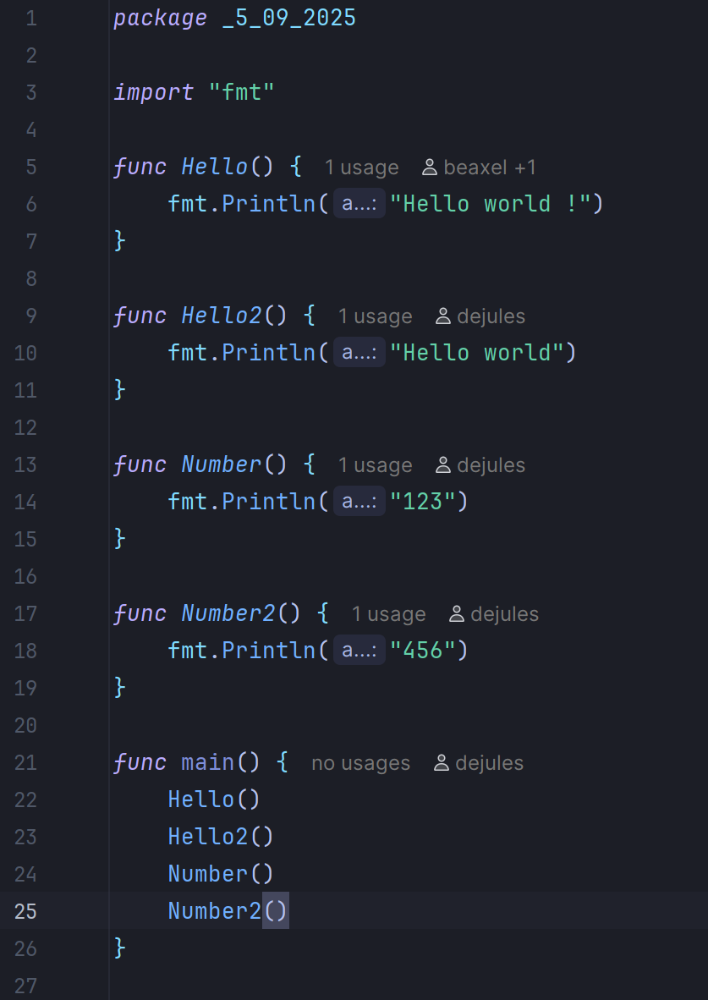

# projet-git-avance-BERING-DEMETZ

## Fonctionnalités

### Fonction A (Personne A):
- Func hello -> print: Hello world !
- Func hello2 -> print: Hello world
- Func number -> print: 123
- Func number2 -> print: 456

### Fonction B (Personne B):
- func test1 -> print This is a first test
- func test2 -> print This is a second test
- func test3 -> print This is a third test

